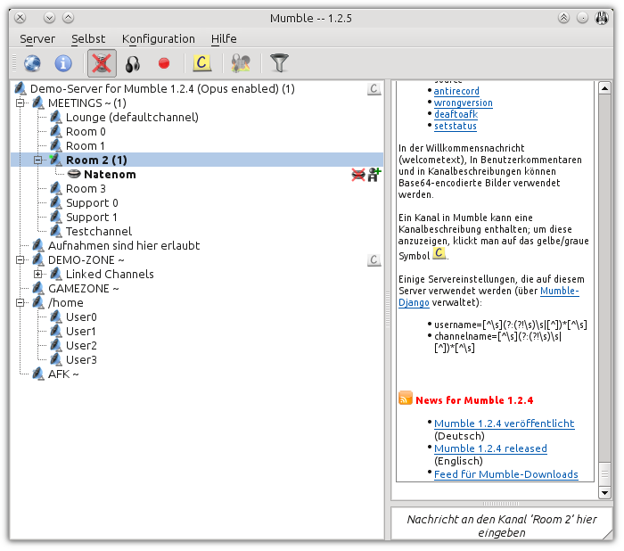

# mumble-skin-slightly
Add some contrast to user and channel icons.

Add some colors to the chat log.

License information can be found in the .qss file.

More Mumble skins can be found [here](http://mumble.sourceforge.net/Skins).
